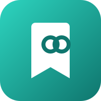

<p align="center">
  <a href="https://linkwarden.app/">
    
  </a>
</p>

# linkwarden-mcp

<!-- mcp-name: io.github.flumpiey/linkwarden-mcp -->

**MCP server for self-hosted [Linkwarden](https://linkwarden.app/): ask your AI about bookmarks, collections, and tags.**

[](LICENSE)
[](https://www.python.org/)
[](https://modelcontextprotocol.io/)
[](https://github.com/flumpiey/linkwarden-mcp/actions/workflows/ci.yml)
[](https://pypi.org/project/linkwarden-mcp/)

## What is Linkwarden?

[Linkwarden](https://linkwarden.app/) is a self-hosted, open-source bookmark manager. You collect, organize, annotate, and preserve webpages in one place, with full-page archives so content stays readable after the original page disappears. It also supports collaboration and public sharing.

This project wires the Linkwarden HTTP API into the [Model Context Protocol](https://modelcontextprotocol.io/) so Cursor, Claude, VS Code Copilot, and other MCP hosts can query your live library in natural language.

Useful Linkwarden links:

- [Documentation](https://docs.linkwarden.app/)
- [GitHub](https://github.com/linkwarden/linkwarden)
- [Cloud](https://linkwarden.app/)
- [Demo](https://demo.linkwarden.app/)
- [Self-hosting setup](https://docs.linkwarden.app/self-hosting/installation)

## What this server does

Default is **read-only**. You get:

- **18 read tools** - discovery (`list_resources`), six core reads (search, get, preserved content, collections, tags, overview), and eleven triage/hygiene workflows
- **Task tools (opt-in)** - intent-shaped writes such as `save_link`, `smart_save_link`, `organise_links`, `create_collection`, `apply_triage_plan` (register when matching write scopes are set)
- **Delete tools (opt-in)** - `delete_links`, `delete_tags`, `merge_tags`, `delete_collection` (register only under delete scopes; never implied by write)
- **Hard denylist** - tokens, session, auth, user admin (except `GET /api/v1/users/me`), migration, and whole-instance preservation stay blocked even when writes are on

Transport is **stdio**. No HTTP server. No global install required if you use [`uv`](https://docs.astral.sh/uv/) / `uvx`.

## Branding / icons

- **stdio hosts (Cursor, Claude Desktop via `mcp.json`):** the server advertises Linkwarden branding in MCP `serverInfo.icons` (embedded PNG data URI, plus a GitHub raw HTTPS fallback).
- **Cursor plugin:** [`.cursor-plugin/plugin.json`](.cursor-plugin/plugin.json) uses [`docs/linkwarden-icon.svg`](docs/linkwarden-icon.svg).
- **Claude Desktop Extension:** pack [`mcpb/`](mcpb/) (includes `icon.png`). See Installation → Claude Desktop below.
- **Claude.ai remote connectors:** Claude.ai ignores `serverInfo.icons` and uses the **root-domain favicon** of the connector URL. If you host a remote MCP later, serve [`docs/favicon.ico`](docs/favicon.ico) at the registrable domain root (e.g. `https://acme.com/favicon.ico` for `https://mcp.acme.com/...`).

## Requirements

- Python ≥ 3.10 (pulled in automatically by `uvx`)
- [uv](https://docs.astral.sh/uv/) (provides `uvx`)
- A reachable Linkwarden instance: `LINKWARDEN_URL` + `LINKWARDEN_TOKEN`

### Access token

1. Sign in to your Linkwarden instance (self-hosted or Cloud).
2. Open **Settings → Access Tokens** (or go to `/settings/access-tokens`).
3. Create a **New Access Token**, give it a name, and copy the value into `LINKWARDEN_TOKEN`.
4. Set `LINKWARDEN_URL` to your instance base URL (no `/api/v1` suffix), e.g. `https://links.example.com` or local Docker `http://127.0.0.1:3000`.

`linkwarden-mcp` sends the token as `Authorization: Bearer …`. API overview: [API Introduction](https://docs.linkwarden.app/api/api-introduction).

## Quick start

Run the [PyPI](https://pypi.org/project/linkwarden-mcp/) package with [`uvx`](https://docs.astral.sh/uv/guides/tools/):

```bash
uvx linkwarden-mcp
```

Paste a client config below, set `LINKWARDEN_URL` / `LINKWARDEN_TOKEN`, restart the host, then ask: *“Find my unread bookmarks about Python”* or *“What's in my Dev collection?”*

From a git clone (dev): `uvx --from git+https://github.com/flumpiey/linkwarden-mcp linkwarden-mcp` or `uv run --directory /path/to/linkwarden-mcp linkwarden-mcp`.

## Installation

Configs below pull [`linkwarden-mcp`](https://pypi.org/project/linkwarden-mcp/) from PyPI. Leave write-scope env vars unset for read-only.

<details>
<summary><strong>Cursor</strong></summary>

**Plugin (Configure UI for URL, token, and scopes):** this repo is a Cursor plugin via [`.cursor-plugin/plugin.json`](.cursor-plugin/plugin.json) + root [`mcp.json`](mcp.json).

1. Symlink or copy the clone to `~/.cursor/plugins/local/linkwarden-mcp` (Windows: `%USERPROFILE%\.cursor\plugins\local\linkwarden-mcp`).
2. Reload the window.
3. Open **Plugins → Configure** on `linkwarden-mcp`. Set **Linkwarden URL** and **Linkwarden API token**. Leave **Write scopes** / **Delete scopes** empty for read-only, or paste a CSV such as `links,collections`.
4. Confirm the `linkwarden` MCP server is enabled under Customize / MCP.

Marketplace listing is a separate submit at [cursor.com/marketplace/publish](https://cursor.com/marketplace/publish).

**Manual `mcp.json`:** project [`.cursor/mcp.json`](.cursor/mcp.json) or user-wide `~/.cursor/mcp.json`.

From PyPI:

```json
{
  "mcpServers": {
    "linkwarden": {
      "type": "stdio",
      "command": "uvx",
      "args": ["linkwarden-mcp"],
      "env": {
        "LINKWARDEN_URL": "https://links.example.com",
        "LINKWARDEN_TOKEN": "your-token"
      }
    }
  }
}
```

Local editable (dev):

```json
{
  "mcpServers": {
    "linkwarden": {
      "type": "stdio",
      "command": "uv",
      "args": ["run", "--directory", "/path/to/linkwarden-mcp", "linkwarden-mcp"],
      "env": {
        "LINKWARDEN_URL": "https://links.example.com",
        "LINKWARDEN_TOKEN": "your-token"
      }
    }
  }
}
```

Optional scoped writes in the `env` block:

```json
"LINKWARDEN_MCP_WRITE_SCOPES": "links,collections",
"LINKWARDEN_MCP_DELETE_SCOPES": "links"
```

Restart Cursor after saving. Confirm `linkwarden` under MCP settings.

</details>

<details>
<summary><strong>Claude Desktop</strong></summary>

**Desktop Extension (`.mcpb`, shows branded icon):** from a clone:

```bash
npx @anthropic-ai/mcpb pack mcpb
```

Install the resulting `.mcpb` (double-click, drag onto Claude Desktop, or Settings → Extensions → Install Extension). Enter URL and token when prompted; leave write/delete scopes empty for read-only. Requires [`uv`](https://docs.astral.sh/uv/) on PATH (`mcp_config` runs `uvx`).

**Manual `mcp.json` config:** edit the Claude Desktop config, then restart the app.

| OS | Path |
|----|------|
| macOS | `~/Library/Application Support/Claude/claude_desktop_config.json` |
| Windows | `%APPDATA%\Claude\claude_desktop_config.json` |

```json
{
  "mcpServers": {
    "linkwarden": {
      "command": "uvx",
      "args": ["linkwarden-mcp"],
      "env": {
        "LINKWARDEN_URL": "https://links.example.com",
        "LINKWARDEN_TOKEN": "your-token"
      }
    }
  }
}
```

Local clone:

```json
{
  "mcpServers": {
    "linkwarden": {
      "command": "uv",
      "args": ["run", "--directory", "/path/to/linkwarden-mcp", "linkwarden-mcp"],
      "env": {
        "LINKWARDEN_URL": "https://links.example.com",
        "LINKWARDEN_TOKEN": "your-token"
      }
    }
  }
}
```

</details>

<details>
<summary><strong>Claude Code</strong></summary>

Add via CLI:

```bash
claude mcp add linkwarden --env LINKWARDEN_URL=https://links.example.com --env LINKWARDEN_TOKEN=your-token -- uvx linkwarden-mcp
```

Or edit `~/.claude.json` / project MCP config:

```json
{
  "mcpServers": {
    "linkwarden": {
      "command": "uvx",
      "args": ["linkwarden-mcp"],
      "env": {
        "LINKWARDEN_URL": "https://links.example.com",
        "LINKWARDEN_TOKEN": "your-token"
      }
    }
  }
}
```

</details>

<details>
<summary><strong>VS Code / GitHub Copilot</strong></summary>

Create [`.vscode/mcp.json`](.vscode/mcp.json) in the project root:

```json
{
  "servers": {
    "linkwarden": {
      "type": "stdio",
      "command": "uvx",
      "args": ["linkwarden-mcp"],
      "env": {
        "LINKWARDEN_URL": "https://links.example.com",
        "LINKWARDEN_TOKEN": "your-token"
      }
    }
  }
}
```

Local editable:

```json
{
  "servers": {
    "linkwarden": {
      "type": "stdio",
      "command": "uv",
      "args": ["run", "--directory", "/path/to/linkwarden-mcp", "linkwarden-mcp"],
      "env": {
        "LINKWARDEN_URL": "https://links.example.com",
        "LINKWARDEN_TOKEN": "your-token"
      }
    }
  }
}
```

Reload the window. Open Copilot Chat and confirm the `linkwarden` tools are available.

</details>

<details>
<summary><strong>Windsurf</strong></summary>

Edit `~/.codeium/windsurf/mcp_config.json` (macOS/Linux) or the Windsurf MCP settings UI:

```json
{
  "mcpServers": {
    "linkwarden": {
      "command": "uvx",
      "args": ["linkwarden-mcp"],
      "env": {
        "LINKWARDEN_URL": "https://links.example.com",
        "LINKWARDEN_TOKEN": "your-token"
      }
    }
  }
}
```

Restart Windsurf after saving.

</details>

<details>
<summary><strong>Zed</strong></summary>

Add under `context_servers` in Zed `settings.json` (Agent Panel → settings also works):

```json
{
  "context_servers": {
    "linkwarden": {
      "command": "uvx",
      "args": ["linkwarden-mcp"],
      "env": {
        "LINKWARDEN_URL": "https://links.example.com",
        "LINKWARDEN_TOKEN": "your-token"
      }
    }
  }
}
```

</details>

<details>
<summary><strong>Cline</strong></summary>

Edit the Cline MCP settings file (`cline_mcp_settings.json` via the Cline MCP UI):

```json
{
  "mcpServers": {
    "linkwarden": {
      "command": "uvx",
      "args": ["linkwarden-mcp"],
      "env": {
        "LINKWARDEN_URL": "https://links.example.com",
        "LINKWARDEN_TOKEN": "your-token"
      }
    }
  }
}
```

</details>

<details>
<summary><strong>Continue</strong></summary>

In `.continue/config.yaml`:

```yaml
mcpServers:
  - name: linkwarden
    command: uvx
    args:
      - linkwarden-mcp
    env:
      LINKWARDEN_URL: https://links.example.com
      LINKWARDEN_TOKEN: your-token
```

</details>

<details>
<summary><strong>Generic / any stdio MCP host</strong></summary>

Any host that can spawn a stdio MCP server:

| Field | Value |
|-------|-------|
| Command | `uvx` |
| Args | `linkwarden-mcp` |
| Env | `LINKWARDEN_URL`, `LINKWARDEN_TOKEN` (+ optional write scopes) |

```bash
uvx linkwarden-mcp
```

Dev from a clone: `uv run --directory /path/to/linkwarden-mcp linkwarden-mcp`.

`npx` only runs npm packages. This is a Python package; use `uvx`.

</details>

## Environment

| Variable | Required | Notes |
|----------|----------|-------|
| `LINKWARDEN_URL` | yes | Instance base URL (no `/api/v1` suffix) |
| `LINKWARDEN_TOKEN` | yes | Sent as `Authorization: Bearer`; never logged |
| `LINKWARDEN_MCP_WRITE_SCOPES` | no | Comma-separated domains for create/update. Empty = no writes. |
| `LINKWARDEN_MCP_DELETE_SCOPES` | no | Comma-separated domains for delete only. Never implied by WRITE_SCOPES. |
| `LINKWARDEN_MAX_BULK` | no | Max records per bulk op (default `25`) |

Valid scopes: `links`, `collections`, `tags`, `raw`. No wildcards (`*`, `all`). `raw` expands effective scopes to all domain scopes (escape hatch).

**Recommended** (covers most bookmark workflows without every mutating tool):

```json
"LINKWARDEN_MCP_WRITE_SCOPES": "links,collections",
"LINKWARDEN_MCP_DELETE_SCOPES": "links"
```

Default with no scopes: **18 tools**. All three domain scopes in WRITE and DELETE: **31 tools**.

Legacy `LINKWARDEN_MCP_ALLOW_WRITES` / `ALLOW_WRITES` / `LINKWARDEN_MCP_WRITES` hard-fail if set. Use the scoped vars instead.

See [`.env.example`](.env.example). Prefer a secret manager for the API token in production configs.

## Write scopes and task tools

When a scope is listed in `LINKWARDEN_MCP_WRITE_SCOPES`, the server registers **task tools** for that domain. `LINKWARDEN_MCP_DELETE_SCOPES` enables delete/merge tools per domain. Call `list_resources` to inspect `read_only`, scope lists, and the live boundary string.

| Tool | Scopes | Purpose |
|------|--------|---------|
| `save_link` | WRITE `links` | Save a URL into a collection (by name) |
| `smart_save_link` | WRITE `links` | Save with optional heuristic collection/tags |
| `organise_links` | WRITE `links` | Move or retag multiple links |
| `update_link` | WRITE `links` | Update link fields (read-modify-write) |
| `queue_archive` | WRITE `links` | Queue preservation (async; not immediate) |
| `apply_triage_plan` | WRITE `links` | Apply `[{link_id, collection?, tags?}]`; default `dry_run=true` |
| `bulk_sort_by_rules` | WRITE `links` | Match `domain_pattern` rules then organise; default `dry_run=true` |
| `create_collection` | WRITE `collections` | Create a collection (optional parent) |
| `auto_tag_by_domain` | WRITE `links` + `tags` | Apply domain→tag rules; default `dry_run=true` |
| `delete_links` | DELETE `links` | Delete multiple links |
| `delete_tags` | DELETE `tags` | Delete tags by id or name |
| `merge_tags` | DELETE `tags` | Merge tags into a new name (destructive) |
| `delete_collection` | DELETE `collections` | Delete a collection and all its links |

Example with recommended scopes only:

```json
"LINKWARDEN_MCP_WRITE_SCOPES": "links,collections",
"LINKWARDEN_MCP_DELETE_SCOPES": "links"
```

**Denylist (always blocked):** `/api/v1/tokens`, `/api/v1/session`, `/api/v1/auth`, `/api/v1/users/**` (except `GET /api/v1/users/me`), migration, and whole-instance preservation worker actions.

## Tools

### Read tools

Always registered (18 total).

| Tool | Purpose |
|------|---------|
| `list_resources` | Discovery; reports `read_only` + live write/delete scopes |
| `search_links` | Search by query, collection, tag, or pin status |
| `get_link` | Full metadata for one link |
| `read_link_content` | Preserved plain text (`textContent` or archive fallback) |
| `list_collections` | Collections with link counts |
| `list_tags` | Tags with link counts |
| `get_library_overview` | Totals, empty collections, unused tags |
| `suggest_collection_for_url` | Heuristic collection suggestions for a URL |
| `suggest_tags_for_link` | Suggest existing-library tags (never invents names) |
| `find_unsorted_links` | List unsorted links (default collection: Unorganized) |
| `triage_links` | Propose collection/tags for link ids (no writes) |
| `find_duplicate_links` | Group links with the same normalized URL |
| `recommend_collection_for_links` | Consensus collection for a batch of links |
| `suggest_links_for_collection` | Find links elsewhere that likely belong |
| `analyze_collection_overlap` | Compare two collections for shared domains/tags/URLs |
| `suggest_collection_structure` | Hygiene: empty, near-duplicate names, overcrowded |
| `align_tags_with_similar_links` | Tags used on similar-domain links |
| `get_sorting_dashboard` | One-shot triage: unsorted, duplicates, empty, largest |

### Write tools

Registered only when matching scopes are set (see table above). Prefer `smart_save_link` / triage tools over raw field edits when you are sorting an inbox.

| Pattern | Requires | Notes |
|---------|----------|-------|
| Link create/update/organise/archive | WRITE `links` | Includes workflow writers with `dry_run` defaults |
| Collection create | WRITE `collections` | Optional parent by name |
| Domain auto-tag | WRITE `links` + `tags` | Only existing tag names |
| Deletes / tag merge | matching DELETE scope | Destructive; confirm ids first |

## Agent Skill

Companion skill: [`skills/linkwarden-bookmarks/SKILL.md`](skills/linkwarden-bookmarks/SKILL.md).

The Cursor plugin discovers this skill from `skills/`. Without the plugin, copy or symlink that folder into your agent skills path. It tells the model to call `list_resources` first, verify after writes, and which workflow tools to prefer.

## Development

```bash
uv sync --extra dev
uv run linkwarden-mcp
```

Offline tests only (respx). No live Linkwarden required:

```bash
uv run ruff check src tests
uv run pytest
```

GitHub Actions matrix: Python 3.10 and 3.12.

## Caveats

- One process ↔ one `LINKWARDEN_URL`. Multi-instance routing is out of scope.
- Multi-user / team disambiguation on a shared instance is **unverified**. Do not claim multi-tenant support until validated against a live shared library.
- Collection/tag suggestions are heuristic and library-local; they do not invent new tag names.
- Bulk mutating workflows default to `dry_run=true`; set `dry_run=false` only after you review the plan.
- ChatGPT Apps need a hosted HTTP MCP endpoint. This package is stdio-only.

## License

MIT. See [LICENSE](LICENSE).
